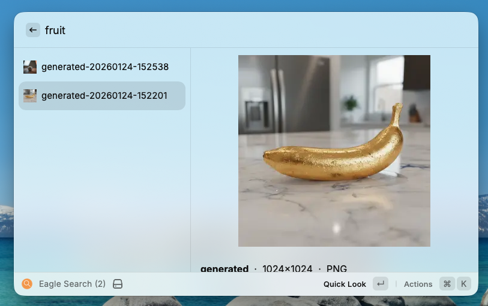
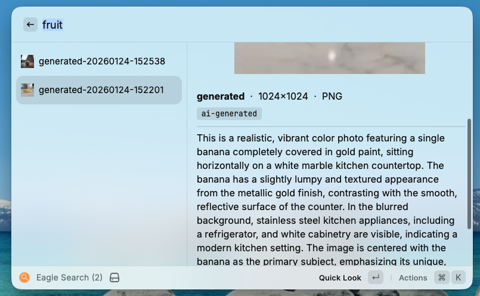
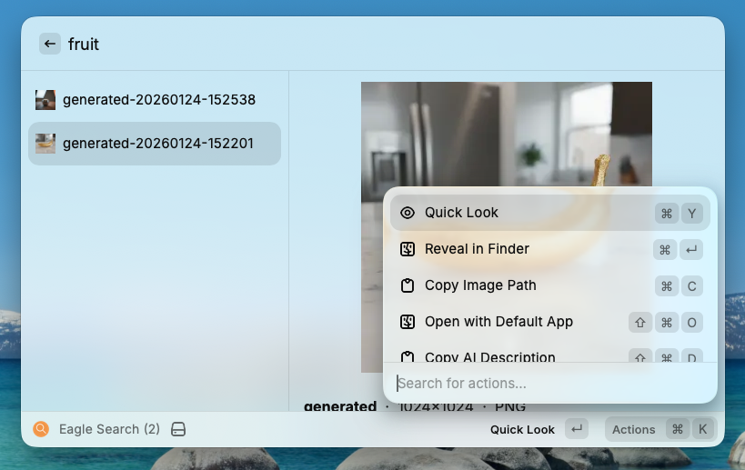
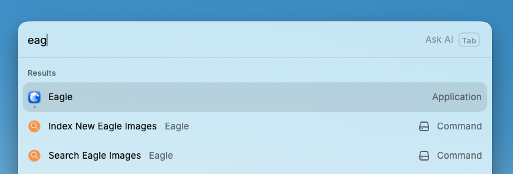

# Eagle Search

Semantic image search for [Eagle.cool](https://eagle.cool) libraries.  Type "Venn diagram" and find images that *look like* Venn diagrams -- even if they were never tagged that way.

Eagle's built-in search only matches filenames and tags literally.  Eagle Search uses AI-generated descriptions to understand what's actually *in* your images, then provides instant full-text search via a Raycast extension.

## How it works

```
┌─────────────────────────────────────────────────┐
│         Raycast Extension (TypeScript)            │
│                                                   │
│  Search box → SQLite FTS5 query → Results list    │
│  Thumbnails, Quick Look, Reveal in Finder         │
│                                                   │
│  No network.  No background processes.            │
│  Sub-millisecond search.                          │
└───────────────────┬───────────────────────────────┘
                    │ reads
                    ▼
┌─────────────────────────────────────────────────┐
│      ~/.eagle-search/                             │
│      ├── db.sqlite        (SQLite + FTS5)         │
│      └── thumbnails/      (cached PNGs)           │
└───────────────────▲───────────────────────────────┘
                    │ writes
┌─────────────────────────────────────────────────┐
│         Indexer (Python, run on-demand)             │
│                                                   │
│  Eagle API → Gemini Flash descriptions → SQLite   │
│                                                   │
│  Skips already-indexed images.                    │
│  ~$0.20 for 1,500 images.  Pennies for updates.  │
└─────────────────────────────────────────────────┘
```

### What the AI sees

For each image, Gemini Flash generates a rich natural-language description:

> *"This is an illustration, specifically a hand-drawn Venn diagram, presented in a black and white, sketchy visual style resembling Excalidraw.  Three overlapping circles are labelled 'Content', 'Data', and 'Direction', with the central intersection labelled 'Personalised, High-Quality Output'.  The title reads 'The Three Ingredients'..."*

This description is indexed alongside your existing tags, filenames, and annotations -- giving you blended search across everything.

## Features

- **Semantic search** -- find images by what they depict, not just how they're tagged
- **Instant results** -- SQLite FTS5, sub-millisecond queries, no network calls at search time
- **No background processes** -- nothing running in RAM when you're not searching
- **Incremental indexing** -- only processes new images, skips existing ones
- **Eagle stays closed** -- search works without Eagle running; Eagle launches only when you open a result
- **Cost-effective** -- ~$0.15 per 1,000 images indexed via Gemini Flash

## Screenshots

**Search results with image preview:**


**AI-generated description and metadata:**


**Actions menu:**


**Raycast commands:**


## Prerequisites

- [Eagle.cool](https://eagle.cool) (v4.0+) with a library
- [Raycast](https://raycast.com) (macOS)
- [Python 3.12+](https://python.org) and [uv](https://docs.astral.sh/uv/)
- [OpenRouter API key](https://openrouter.ai/settings/keys) (for Gemini Flash image descriptions)
- macOS Full Disk Access for Terminal (required to read Eagle's iCloud Drive library)

## Setup

### 1. Clone and install

```bash
git clone https://github.com/pelby/eagle-search.git
cd eagle-search

# Python indexer
cd indexer
uv sync
cd ..

# Raycast extension
cd raycast-extension
npm install
npm run build
cd ..
```

### 2. Configure API key

The indexer uses your `OPENROUTER_API_KEY` environment variable.  If you don't have one:

1. Sign up at [OpenRouter](https://openrouter.ai)
2. Create an API key at [Settings > Keys](https://openrouter.ai/settings/keys)
3. Add to your shell profile:
   ```bash
   export OPENROUTER_API_KEY="sk-or-..."
   ```

### 3. Grant Full Disk Access

Eagle stores its library on iCloud Drive, which macOS protects.  Your terminal app needs Full Disk Access:

1. Open **System Settings > Privacy & Security > Full Disk Access**
2. Add your terminal app (Terminal, iTerm2, Warp, etc.)
3. Restart the terminal app

### 4. Index your library

Open Eagle, then run:

```bash
cd eagle-search/indexer
uv run python -m src index
```

This will:
- Connect to Eagle's local API (port 41595)
- Generate AI descriptions for each image via Gemini Flash
- Cache thumbnails locally
- Store everything in `~/.eagle-search/db.sqlite`

Progress is shown as `[42/1522] image-name...`.

### 5. Install the Raycast extension

```bash
cd eagle-search/raycast-extension
npm run dev
```

This registers the extension with Raycast.  You can stop the dev server afterwards -- the extension stays installed.

## Usage

### Search

Open Raycast and type "Search Eagle Images" (or assign a hotkey).

- **Type any concept** -- "Venn diagram", "hand drawn sketch", "orange logo", "staircase illustration"
- **Enter** -- Quick Look (full-size preview)
- **Cmd+Enter** -- Reveal in Finder
- **Cmd+C** -- Copy image path
- **Cmd+Shift+D** -- Copy AI description

### Index new images

After adding new images in Eagle, run "Index New Eagle Images" from Raycast, or from the terminal:

```bash
cd eagle-search/indexer
uv run python -m src index
```

Already-indexed images are skipped automatically.  You only pay for new ones.

### CLI tools

```bash
uv run python -m src stats       # Show index statistics
uv run python -m src search "q"  # Test search from terminal
uv run python -m src reindex     # Force re-index everything (rare)
```

## Architecture

### Why not CLIP?

CLIP (OpenAI's vision-language model) is the obvious choice for image search.  We considered it and chose a different approach:

| | CLIP | Gemini Flash descriptions |
|---|---|---|
| **Search speed** | ~50ms (needs model loaded) | <1ms (SQLite FTS5) |
| **RAM usage** | ~2GB (PyTorch in memory) | 0 (no model at runtime) |
| **Background process** | Required (Python server) | None |
| **Search quality** | Numeric similarity scores | Natural language (richer) |
| **Cost** | Free (local) | ~$0.15 / 1,000 images |

For a library of 1,000-5,000 images, the Gemini Flash approach gives better search quality with zero runtime overhead.  CLIP would make more sense for very large libraries (50,000+) where API costs become significant.

### Tech stack

- **Indexer**: Python, httpx, Pillow, SQLite
- **Search**: Raycast extension (TypeScript), SQLite FTS5 via `@raycast/utils`
- **AI**: Gemini Flash via OpenRouter (vision model for descriptions)
- **Storage**: SQLite with FTS5 full-text search, local thumbnail cache

## Cost

| Operation | Cost |
|---|---|
| Initial index (1,500 images) | ~$0.20 |
| Daily incremental (5-10 images) | ~$0.001 |
| Search queries | $0 (local SQLite) |
| Monthly ongoing | ~$0.03 |

## Limitations

- Eagle must be running during indexing (for its local API)
- Requires macOS Full Disk Access for the terminal app
- FTS5 is keyword-based, not semantic -- search quality depends on description quality
- Currently macOS only (Raycast requirement)

## Contributing

Contributions welcome.  Some ideas:

- [ ] Auto-index on Eagle library changes (filesystem watcher)
- [ ] Raycast Store submission
- [ ] Web UI alternative for non-Raycast users
- [ ] OCR for text-heavy images
- [ ] Support for multiple Eagle libraries

## Licence

[MIT](LICENSE)
